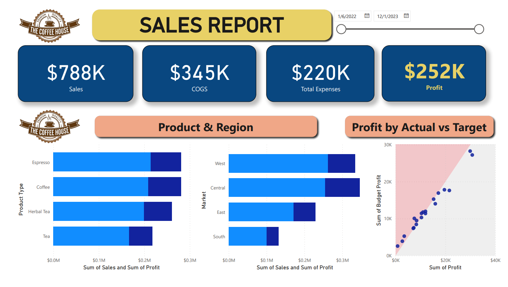

# Coffee-House-Sales-Dashboard
Power BI Sales Dashboard for The Coffee House: An interactive and insightful sales analysis featuring total sales, cost of goods sold, expenses, profit, and regional/product performance insights.

# Sales Dashboard in Power BI for The Coffee House

## Overview
This repository contains a comprehensive sales dashboard created using Power BI for "The Coffee House." The dashboard provides insights into key performance metrics such as sales, cost of goods sold (COGS), total expenses, and profit. It also includes detailed visualizations to analyze sales and profit by product type and region, as well as performance against profit targets.

## Key Features
- **Total Sales:** $820K
- **Cost of Goods Sold (COGS):** $359K
- **Total Expenses:** $230K
- **Profit:** $260K
- **Sales & Profit Analysis by Product Type:** Breakdown of sales and profit for Espresso, Coffee, Herbal Tea, and Tea.
- **Regional Sales Analysis:** Performance comparison across West, Central, East, and South regions.
- **Profit Analysis (Actual vs. Target):** Visualization of actual profit compared to budgeted targets.

## Files in the Repository
- `Sales Dashboard-P3.pbix`: The Power BI Desktop file for the sales dashboard.
- `README.md`: Project overview, features, and file descriptions.
- `dashboard-image.png`: A screenshot of the sales dashboard (add this to visually show the dashboard in your README).

## About the Dashboard
This Power BI dashboard was created to provide an easy-to-understand overview of sales performance, highlight the best-selling products and regions, and assess profit performance against targets. The visuals and insights can help stakeholders make data-driven decisions and optimize strategies.

## How to Use
1. **Clone or download the repository:**
2.  **Open the `.pbix` file in Power BI Desktop.**

3. **Explore and interact with the dashboard:**
- Use filters to adjust the timeframe and focus on specific regions or products.
- Analyze sales trends and profit performance.

## Screenshot

## Tools & Technologies
- **Power BI**: Data visualization and business intelligence.
- **Data Sources**: Sales data for The Coffee House.

